# **MoMify - AI-Powered Meeting Minutes Generator** 📝🤖  
**Automatically transcribe, summarize, and generate meeting minutes from audio/video files.**

## 🚀 Features
- **🎙️ Speech-to-Text**: Uses **OpenAI Whisper** for accurate transcriptions.
- **📑 AI Summarization**: Generates structured MoM using **GPT-4**.
- **📄 PDF Export**: Professionally formatted MoM with customizable fonts, colors, and language.
- **🌍 Multi-language Support**: Supports English, Bahasa Indonesia, Malay, and Tagalog.
- **🎨 Customization Options**: Adjust font, bold text color, and note language.
- **📂 Supports Various Formats**: Accepts **MP3, WAV, MP4, M4A, AVI, MKV, MPEG4** (Max file size: **1GB**).


## **📂 Project Structure**
```
Audio2Summary/
│── .streamlit/                 # Streamlit settings (if needed)
│── assets/                     # UI assets (images, CSS, fonts)
│── inputs/                     # Raw uploaded files
│── outputs/                    # Processed MoM PDFs
│── ui_components/               # Modular UI components
│   ├── __init__.py
│   ├── customization.py         # Customization UI for fonts/colors
│   ├── file_upload.py           # File upload component
│   ├── introduction.py          # Welcome page UI
│   ├── processing.py            # Processing logic
│   ├── stepper.py               # Stepper UI to track progress
│
│── uploads/                     # Temporary file storage
│── .env                         # API Keys & Config
│── .gitignore                   # Ignored files
│── app.py                       # Main FastAPI App
│── main.py                      # Backend logic (testing & processing)
│── Pipfile                      # Dependency management (Pipenv)
│── Pipfile.lock                  # Dependency lock file
│── README.md                     # You are here!
│── test.py                       # Test cases
│── ui.py                         # Streamlit UI
```

## **📽️ Video Demo**
🎥 Watch how MoMify works in action!  
[](https://youtu.be/Pp-YiPpT4Lw)
🔗 **Click the image above to watch the full demo!**  

## 📸 Steps and Screenshots

### Landing Page
- **This is the landing page, where you can expand sections to see what MoM is and how MoMify works.**
  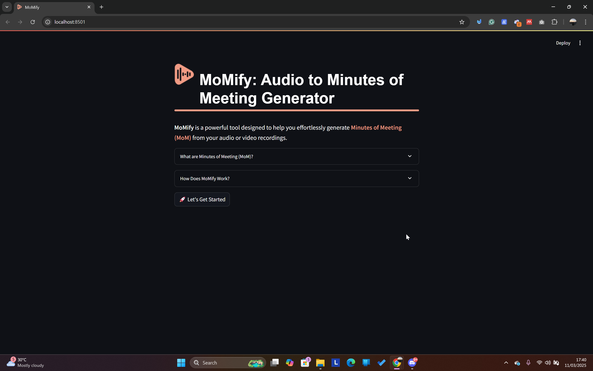

### What are Minutes of Meeting (MoM)?
- **Explanation about MoM and an example of it.**
  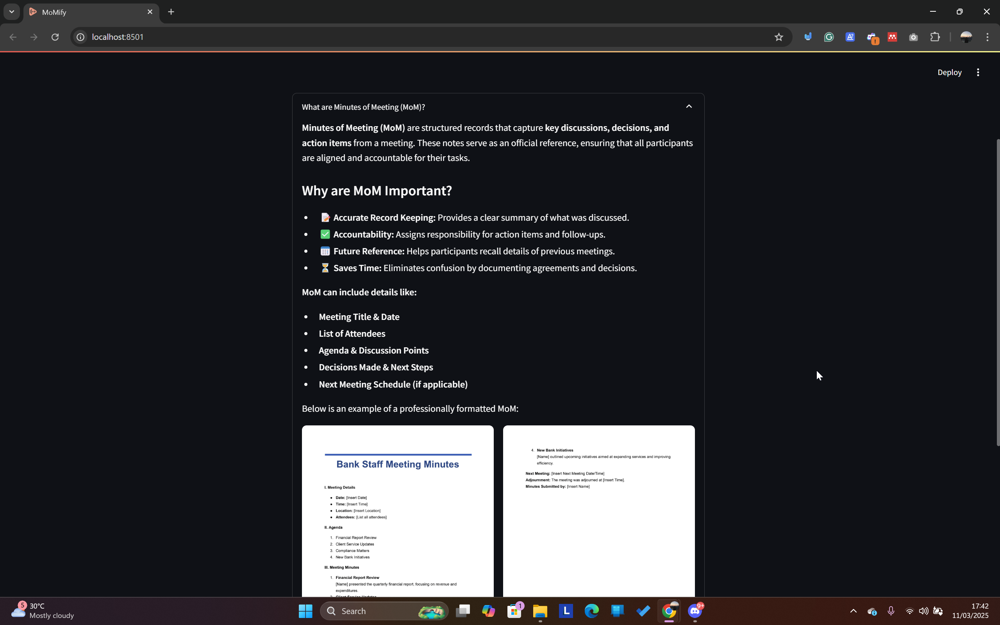

### How Does MoMify Work?
- **Shows the process from uploading audio, speech-to-text conversion, AI-powered summarization, MoM generation, and customization for PDF export.**
  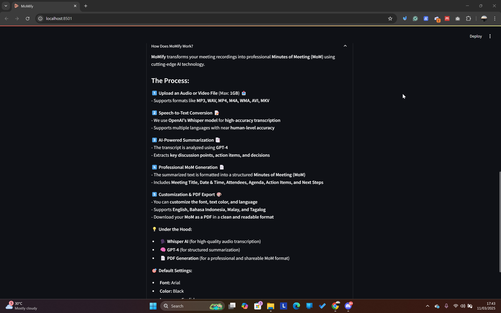

### Getting Started
- **Clicking the "Let's Get Started" button leads to customization options.**
  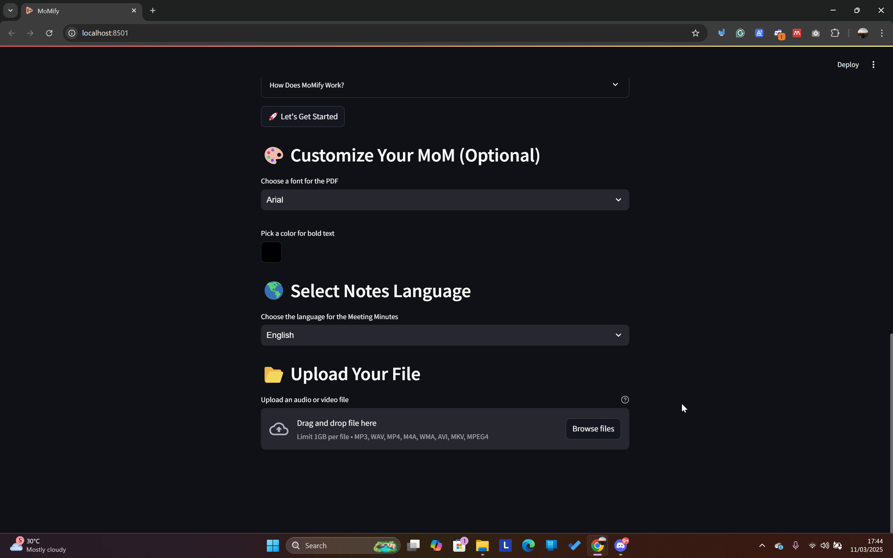

### Customizing Your MoM
- **Choosing a font for the PDF** \
    You can choose from:
  - Arial
  - Courier
  - Times
  - Helvetica
  - Poppins (Example chosen in screenshots)
    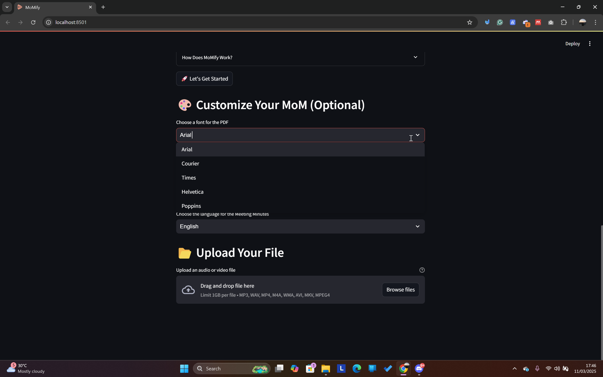
- **Choosing a color for bold text** \
Pick any color for the bolded text using a color picker.
  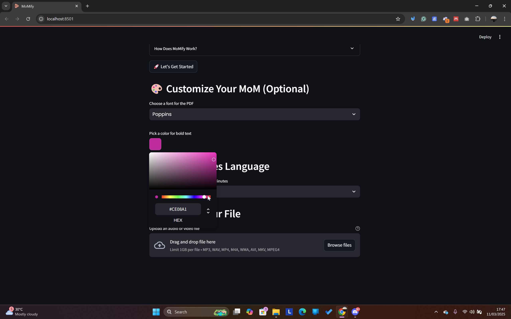
- **Choosing the language for the MoM notes** \
    MoMify supports multiple languages, so you can generate notes in a language different from the original file. Currently supported languages:
  - English
  - Bahasa Indonesia
  - Malay
  - Tagalog
  For example, you can upload an English audio file and generate MoM in Bahasa Indonesia.
    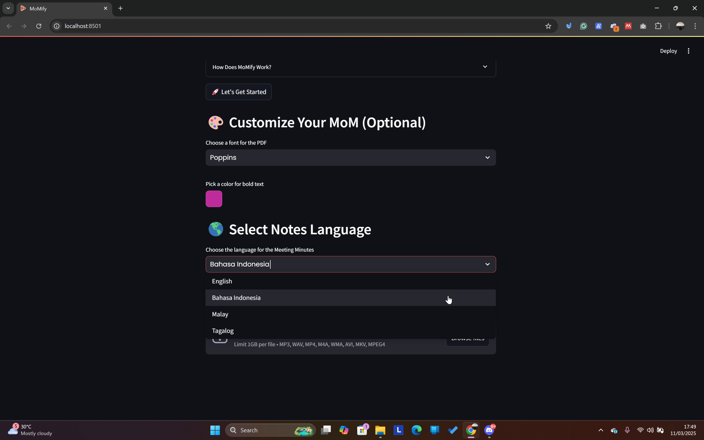


### Uploading a File  
- **Drag and drop or browse to upload an audio/video file.**  

  You can:  
  - Drag & Drop or Browse Files.  
  - View **MoM Configuration Summary** before processing:  
    ```
    Font: Poppins
    Bold Text Color: #ce08a1
    Language: Bahasa Indonesia
    Uploaded File Type: video/mp4
    ```
  
  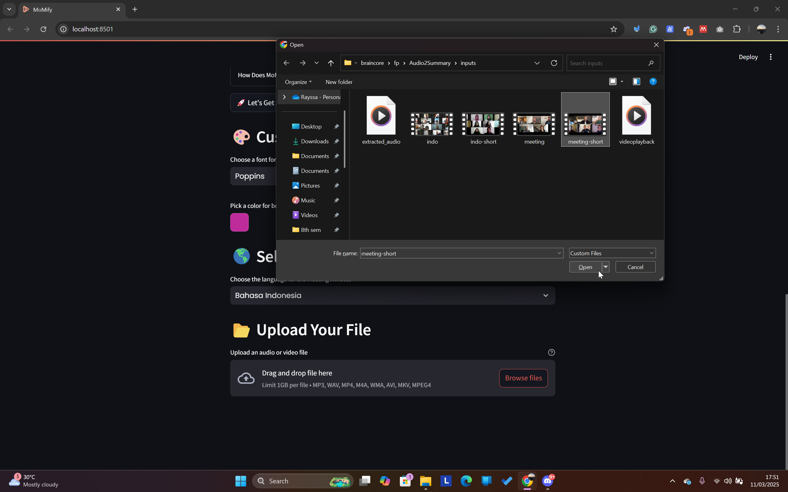

### Processing Steps
- **Once uploaded, MoMify starts processing with a step-by-step indicator.**
  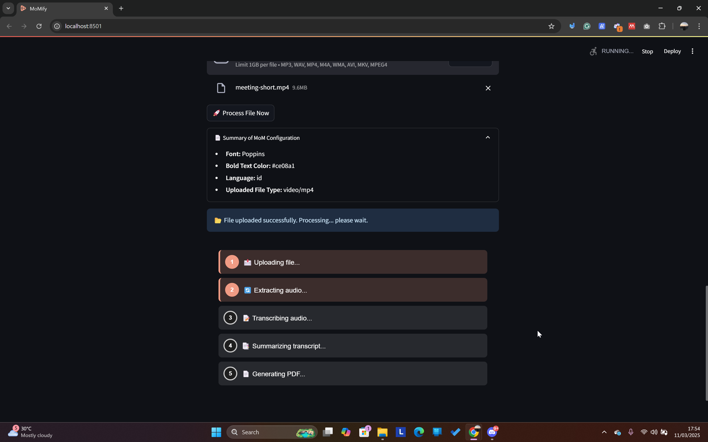

### Completion & Downloading the PDF
- **After processing, a "Download PDF" button appears.**
  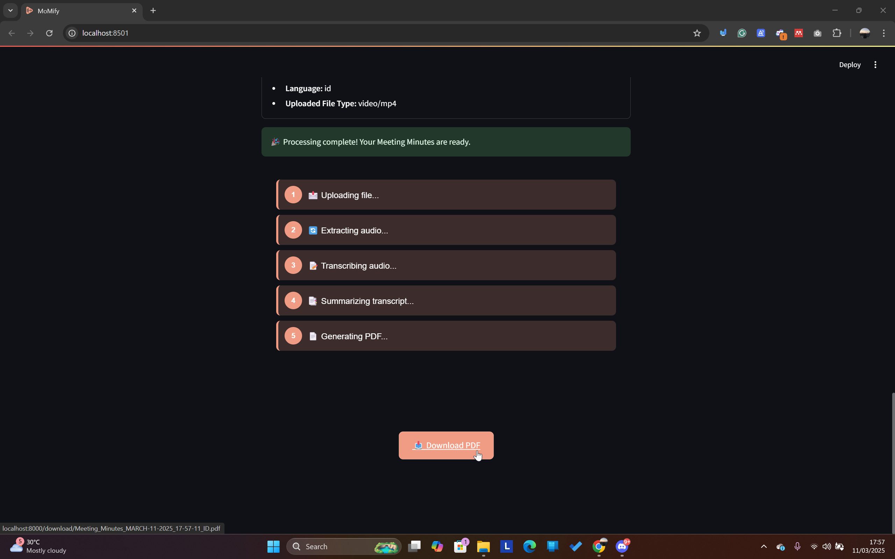
- **Output PDF Example**
    The generated PDF:
  - Uses selected font and bold color.
  - Includes a timestamp of when the MoM was created.
  - Is structured with clear section headers and bullet points.
    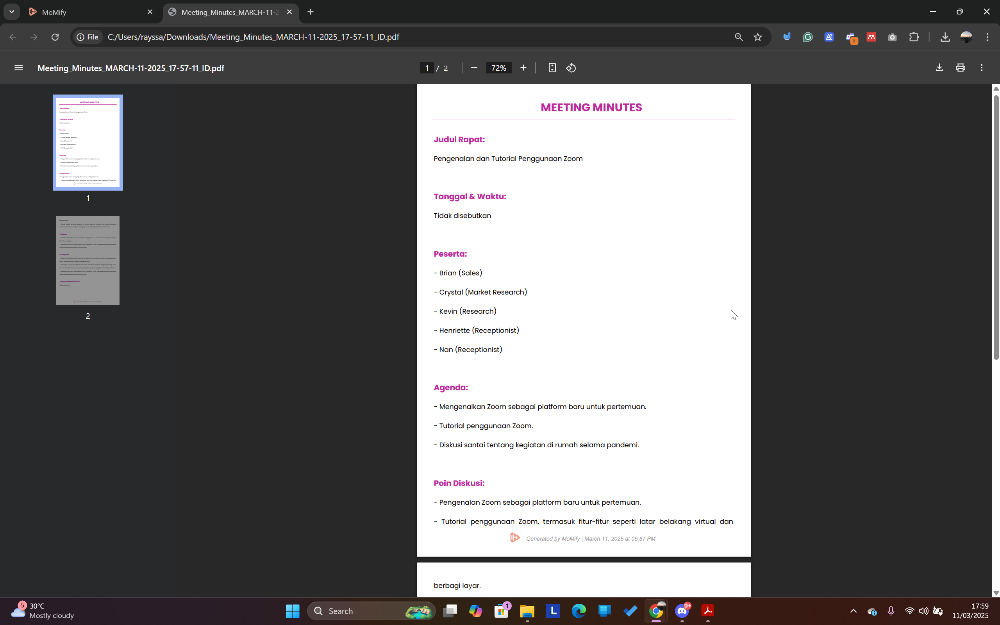  
    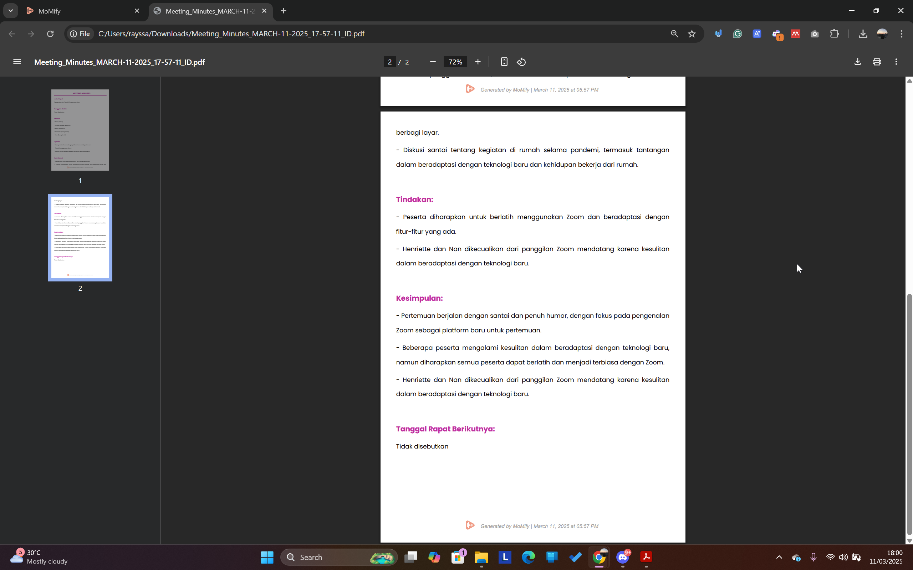

## **🛠️ Installation**
### **1️⃣ Clone the Repository**
```sh
git@github.com:rayrednet/Audio2Summary.git
cd Audio2Summary
```

### **2️⃣ Set Up a Virtual Environment**
```sh
python -m venv venv
source venv/bin/activate  # macOS/Linux
venv\Scripts\activate     # Windows
```

### **3️⃣ Install Dependencies**
```sh
pip install -r requirements.txt
```

### **4️⃣ Set Up Your API Keys**  
Create a `.env` file in the root directory and add the following:  

```ini
OPENAI_API_KEY=your_openai_api_key_here
LANGCHAIN_API_KEY=your_langchain_api_key_here
LANGCHAIN_TRACING_V2=true
LANGCHAIN_PROJECT=your_project_name_here
```

🔹 Replace `your_openai_api_key_here` and `your_langchain_api_key_here` with your actual API keys.  
🔹 Set `LANGCHAIN_PROJECT` to your preferred project name (e.g., `audio2summary`).  


### **5️⃣ Run the Application**
Start the **FastAPI backend**:
```sh
uvicorn app:app --host 0.0.0.0 --port 8000 --reload
```

Start the **Streamlit frontend**:
```sh
streamlit run ui.py
```

## **🚀 API Usage**
### **1️⃣ Upload & Process File**
```http
POST /upload/
```
**Request (multipart/form-data)**
```sh
curl -X 'POST' 'http://127.0.0.1:8000/upload/' \
  -H 'accept: text/event-stream' \
  -H 'Content-Type: multipart/form-data' \
  -F 'file=@audio.mp3' \
  -F 'font=Arial' \
  -F 'color=000000' \
  -F 'language=en'
```

**Response (Streaming)**
```
⏳ Upload successful. Starting processing...
🔄 Extracting audio...
📝 Transcribing audio...
📑 Summarizing transcript...
📄 Generating PDF...
✅ Processing complete! Download: /download/Meeting_Minutes.pdf
```

### **2️⃣ Download Processed PDF**
```http
GET /download/{filename}
```
Example:
```sh
curl -X 'GET' 'http://127.0.0.1:8000/download/Meeting_Minutes.pdf' \
  -H 'accept: application/pdf' --output Meeting_Minutes.pdf
```

## **⚡ Technology Stack**
- **FastAPI** - API backend  
- **OpenAI Whisper** - Speech-to-text transcription  
- **LangChain + GPT-4** - AI-powered summarization  
- **FPDF** - PDF generation  
- **MoviePy & Pydub** - Audio & video processing  
- **Uvicorn** - ASGI server

## **🙌 Contributing**
1. **Fork this repo**  
2. Create a **feature branch**  
3. **Commit & push** your changes  
4. Submit a **Pull Request**
